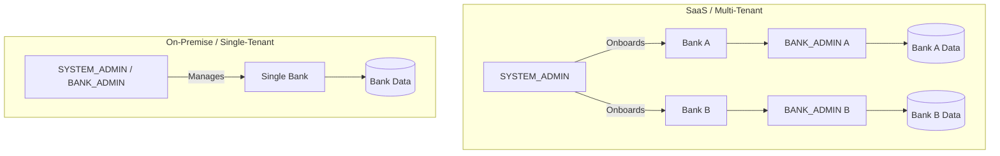
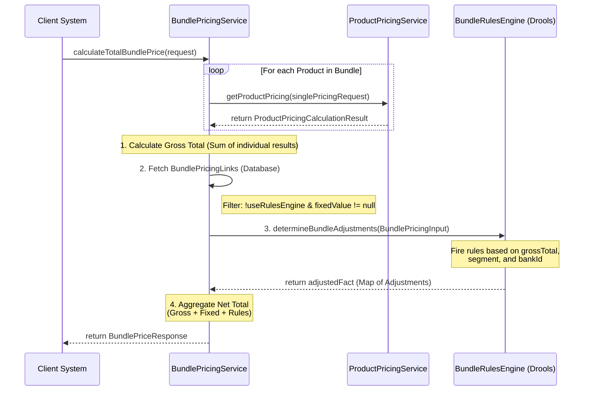

# Plexus
Configurable Banking Product & Pricing Engine. A flexible microservice built on Spring Boot for defining, managing, and calculating complex global banking products, features, and pricing rules.

Plexus is a scalable banking platform built with Java and Spring Boot. It implements a component-based architecture to provide complete flexibility for product managers.

## Key Capabilities:
1.  **Product Catalog Service (PCS):** Define any banking product using flexible, reusable feature components (e.g., tenure, collateral type, network).
2.  **Pricing Engine Service (PES):** Manage tiered pricing, fees, and interest rates, accessible via a dedicated calculation endpoint.
3.  **Role-Based Access Control (RBAC):** Implemented using **JWTs** and a custom **Resource Server** architecture, enabling **granular permission checks** on all API endpoints.
4.  **Rule Management Service (RMS) Integration:** Supports integration with external rules engines for dynamic calculation of discounts, waivers, and eligibility.
5.  **Multi-Bank Support:** Designed for global deployment.

***

# Application Architecture & Multi-tenancy

Plexus is designed as a multi-tenant platform, supporting both single-instance (On-prem) and multi-instance (SaaS) deployments.

## 1. Multi-tenant Isolation
Isolation is enforced at the database level using a shared-schema, row-level filtering approach:
- **Tenant Identifier**: Every tenant-aware entity inherits from `AuditableEntity` which contains a `bank_id` column.
- **Automatic Filtering**: A Hibernate filter (`bankTenantFilter`) is automatically applied to all repository calls via an Aspect (`TenantFilterAspect`), ensuring users only see data belonging to their bank.
- **Context Management**: The `TenantContextHolder` (ThreadLocal) stores the current request's `bankId`, which is extracted from the JWT by the `JwtAuthConverter`.

## 2. Core Entities for Management
- **`BankConfiguration`**: Defines the tenant itself.
  - `bankId`: Unique readable identifier (e.g., `GLOBAL-BANK-001`).
  - `issuerUrl`: The OIDC Issuer URI for this specific tenant (e.g., `https://login.microsoftonline.com/{tenantId}/v2.0`). This is used to validate incoming JWTs.
  - `allowProductInMultipleBundles`: Business rule flag.
- **`Role`**: Bank-specific roles (e.g., `BANK_ADMIN` for `BANK_A`) are stored with their mapped permissions.

***

# Product Catalog and Pricing Model
This system employs a decoupled, highly reusable architecture where Products are assembled by linking to reusable Components. This design prevents data duplication and centralizes maintenance for both feature configurations and complex pricing rules.

***

## 1. Core Concept: Decoupling Definitions from Products
The key to understanding the model is the distinction between a Component (the reusable master definition) and a Link (the product-specific value or context).

| Domain       | Master Component (Definition) | Link Entity (Product-Specific Usage) | Purpose of the Link                                                                                    |
|:-------------|:------------------------------|:-------------------------------------|:-------------------------------------------------------------------------------------------------------|
| **Features** | **`FeatureComponent`**        | **`ProductFeatureLink`**             | Holds the specific **VALUE** (e.g., '120') for a feature on a Product.                                 |
| **Pricing**  | **`PricingComponent`**        | **`ProductPricingLink`**             | Establishes the **BINDING** and **CONTEXT** (e.g., 'CORE\_RATE') for a pricing component on a Product. |

***

## 2. Entity Relationship Overview
The core entities and their roles in defining a complete product offering:

| Entity Name              | Location        | Role in the Model                                                       | Key Data Stored                                             |
|:-------------------------|:----------------|:------------------------------------------------------------------------|:------------------------------------------------------------|
| **`Product`**            | Catalog Service | The primary, effective-dated product entity (e.g., "Premier Checking"). | `name`, `bankId`, `effectiveDate`, `status`                 |
| **`ProductType`**        | Catalog Service | High-level category for a Product (e.g., `CASA`, `Loan`).               | `name`                                                      |
| **`FeatureComponent`**   | Catalog Service | The global **definition** of a product attribute.                       | `name` (e.g., "Max\_Tenor"), `dataType`                     |
| **`ProductFeatureLink`** | Catalog Service | **M:N link** between a `Product` and a `FeatureComponent`.              | **`featureValue`** (The concrete value, e.g., `"120"`)      |
| **`PricingComponent`**   | Pricing Service | The global **definition** of a reusable rate or fee structure.          | `name` (e.g., "Monthly Fee"), `type` (e.g., `FEE`, `RATE`)  |
| **`PricingTier`**        | Pricing Service | A specific rule or segment **within** a `PricingComponent`.             | `tierName`, `minThreshold`, `conditionValue`                |
| **`PriceValue`**         | Pricing Service | The actual monetary/rate value associated with a `PricingTier`.         | `priceAmount`, `valueType` (e.g., `ABSOLUTE`, `PERCENTAGE`) |
| **`ProductPricingLink`** | Pricing Service | **M:N link** between a `Product` and a `PricingComponent`.              | **`context`** (The purpose, e.g., `"CORE_FEE"`)             |
| **`Role`**               | Auth Service    | Defines a set of permissions (authorities).                             | `name`, linked `authorities` (permissions)                  |

***

## 3. Security and Authorization Model (RBAC)

Plexus enforces security via an internally managed Role-Based Access Control (RBAC) layer integrated with Spring Security's OAuth2 Resource Server.

### A. JWT Structure and Authority Extraction
* **JWT Validation:** Tokens are validated against configurable claims (`iss`, `aud`, `exp`).
* **Custom Authority Converter (`JwtAuthConverter`):** This component reads the custom **`roles`** claim (which supports an array of roles) from the JWT.
* **Permission Mapping:** It uses the `PermissionMappingService` to fetch the complete set of unique, aggregated **Authorities** (`<domain>:<resource>:<action>`, e.g., `catalog:product:read`) from the internal database based on the roles present in the token.

#### Sample Required JWT Payload
For a token to be accepted and successfully authorize a user (e.g., a `BANK_ADMIN`), the payload must include all configured claims:

```json
{
  "sub": "dev_user_identifier",
  "bank_id": "GLOBAL-BANK-001",
  "roles": ["BANK_ADMIN", "ANALYST"],
  "iss": "http://localhost:8080",
  "aud": "bank-engine-api",
  "iat": 1732540800,
  "exp": 1795697637
}
```

### B. Access Control
Access is granted using method-level security with **`@PreAuthorize`**.

* **Example:** `@PreAuthorize("hasAuthority('catalog:product:read')")`
* **Role Mapping Endpoint:** The `/api/v1/roles/mapping` endpoint is used to maintain the relationship between role names (e.g., `PRICING_ENGINEER`) and the actual system authorities. **Validation** is enforced to prevent mapping invalid permissions.

### C. System Permissions Discovery
To ensure consistency and performance, the application discovers all available authorities by scanning **`@PreAuthorize`** annotations via reflection during startup. This master list is then **cached** in memory using Spring's `@Cacheable` to optimize subsequent authorization lookups and validation checks, avoiding repeated reflection overhead.

***

# Identity Provider (IDP) Integration

Plexus works with any OIDC-compatible IDP (EntraID, Keycloak, Auth0, etc.). The application requires two custom claims in the JWT:
1.  **`bank_id`**: A string identifying the tenant (e.g., `SYSTEM` or `MY-BANK-001`).
2.  **`roles`**: An array of strings representing the user's roles (e.g., `["BANK_ADMIN"]`).

### 1. Microsoft EntraID (Azure AD) Setup
To add custom claims at the organization level without modifying individual user records:
1.  **App Registration**: Register Plexus in EntraID.
2.  **Token Configuration**:
    - Go to **Token configuration** > **Add optional claim**.
    - Choose **ID** or **Access** token.
3.  **Custom Claim (Claims Transformation)**:
    - Go to **Enterprise Applications** > Select your app > **Single sign-on** > **Attributes & Claims**.
    - Click **Add new claim**.
    - **Name**: `bank_id`.
    - **Source**: `Attribute` or `Transformation`.
    - **Value**: For a fixed-value tenant, enter the bank ID as a constant string (e.g., `"GLOBAL-BANK-001"`).
    - Repeat for `roles`, mapping it to the user's security groups or a constant value.

### 2. Keycloak Setup
1.  **Client Scopes**: Create a new Client Scope (e.g., `plexus-scope`).
2.  **Mappers**: Add a "User Attribute" or "Hardcoded Claim" mapper.
    - **Mapper Type**: `Hardcoded claim`.
    - **Token Claim Name**: `bank_id`.
    - **Claim Value**: `MY-BANK-001`.
3.  **Assign**: Assign this scope to your Plexus client.

***

# Setup & Deployment

## 1. Prerequisites
- **Java 21**: The application is built using Java 21.
- **Docker & Docker Compose**: Required for running the full stack locally.
- **Gradle 8.x**: (Optional) The project includes a Gradle wrapper (`./gradlew`).

## 2. Local Development

### A. Quick Start with Docker Compose
The fastest way to get the entire stack (App, Database, Mock OAuth) running:

```bash
docker-compose up --build -d
```

- **App**: `http://localhost:8080`
- **PostgreSQL**: `localhost:5432` (User: `user`, Pass: `password`, DB: `bankengine`)
- **Mock OAuth Server**: `http://localhost:9090/default`
  - Debugger: `http://localhost:9090/default/debugger`

### B. Running Locally (IDE/CLI)
For active development with hot-reloading (via H2 database):

1. **Set Profile**: Ensure `SPRING_PROFILES_ACTIVE=dev` is set.
2. **Run App**:
   ```bash
   ./gradlew bootRun
   ```
- **H2 Console**: `http://localhost:8080/h2-console` (JDBC URL: `jdbc:h2:mem:plexusdb`)

## 3. Deployment to Azure

The application is configured for deployment to **Azure Web App for Containers** using **GitHub Actions**.

### A. CI/CD Pipeline
The workflow in `.github/workflows/deploy-azure.yml` handles:
1. **Build & Test**: Running `./gradlew build`.
2. **Dockerize**: Building the image and pushing it to **Azure Container Registry (ACR)**.
3. **Deploy**: Updating the Azure Web App (Staging/Production).

### B. Required GitHub Secrets
To use the provided pipeline, configure these secrets in your GitHub repository:
- `ACR_LOGIN_SERVER`: Your ACR login server (e.g., `myregistry.azurecr.io`).
- `ACR_USERNAME`: ACR service principal or admin username.
- `ACR_PASSWORD`: ACR service principal or admin password.
- `AZURE_WEBAPP_PUBLISH_PROFILE`: The publish profile XML from your Azure Web App.

## 4. Environment Configuration Reference
Key properties that can be overridden via environment variables:

| Property | Environment Variable | Default (Dev) |
| :--- | :--- | :--- |
| `app.security.system-bank-id` | `SYSTEM_BANK_ID` | `SYSTEM` |
| `app.security.system-issuer` | `SYSTEM_JWT_ISSUER_URI` | *Azure AD Default* |
| `spring.datasource.url` | `SPRING_DATASOURCE_URL` | `jdbc:h2:mem:testdb` |
| `spring.profiles.active` | `SPRING_PROFILES_ACTIVE` | `dev` |

## 5. Deployment Models: SaaS vs On-Premise

Plexus runs the **same code** for both models. The difference is purely operational.



### SaaS Deployment
- **Platform Owner**: Acts as `SYSTEM_ADMIN`.
- **Capability**: Can onboard multiple banks (tenants).
- **Data Isolation**: The `SYSTEM_ADMIN` can **only** onboard banks and manage global roles. They **cannot** see or modify actual bank data (products, pricing) due to granular authorities and Hibernate filters.
- **Handover**: After onboarding, the `SYSTEM_ADMIN` creates the first `BANK_ADMIN` for that tenant, who then takes over.

### On-Premise / Private Cloud
- **Ownership**: The bank owns the entire instance.
- **Setup**: `SYSTEM_ADMIN` and `BANK_ADMIN` roles might be held by the same individuals.
- **Tenant**: Typically only one tenant is ever created.

***

## 4. Real-World Example: "Premier Checking Account"
Let's trace how the **"Premier Checking Account"** is fully configured using this decoupled model.

### A. Step 1: Defining the Reusable Components (Masters)
These entities are generic and defined once in their respective services:

| Entity                 | ID      | Name                    | Role/Type                     | Notes                                     |
|:-----------------------|:--------|:------------------------|:------------------------------|:------------------------------------------|
| **`FeatureComponent`** | 101     | `MaxFreeATMWithdrawals` | `INTEGER`                     | Defines the attribute: up to what number? |
| **`PricingComponent`** | 201     | `MonthlyServiceFee`     | `FEE`                         | Defines the concept of a monthly fee.     |
| **`PricingTier`**      | 201-1   | `Standard`              | Condition: `SEGMENT=STANDARD` | Rule for standard customers.              |
| **`PriceValue`**       | 201-1-V | `10.00`                 | `ABSOLUTE`, `USD`             | The actual price for the Standard rule.   |
| **`PricingTier`**      | 201-2   | `Premium`               | Condition: `SEGMENT=PREMIUM`  | Rule for premium customers.               |
| **`PriceValue`**       | 201-2-V | `0.00`                  | `WAIVED`                      | The price for the Premium rule (waived).  |

### B. Step 2: Configuring the Product (Linking)
The `Product` entity (ID 50) is created and then **linked** to the reusable components to create its unique definition:

| Entity                   | Product ID | Component ID                  | Key Value        | Description                                                                |
|:-------------------------|:-----------|:------------------------------|:-----------------|:---------------------------------------------------------------------------|
| **`ProductFeatureLink`** | 50         | 101 (`MaxFreeATMWithdrawals`) | **`"5"`**        | The Premier Account sets the value of the feature to **5**.                |
| **`ProductPricingLink`** | 50         | 201 (`MonthlyServiceFee`)     | **`"CORE_FEE"`** | The Product links to the Monthly Fee structure, calling it the `CORE_FEE`. |

***

## 5. The Calculation and Retrieval Flow
The goal is for a consuming application (e.g., a customer onboarding system) to retrieve the correct feature value or calculate the correct price without knowing the internal structure of the components.

### Feature Retrieval
* **Client Request**: Retrieve `MaxFreeATMWithdrawals` for Product ID `50`.
* **Action**: The Catalog Service reads `Product` 50, traverses the `ProductFeatureLink` pointing to `FeatureComponent` 101, and returns the stored `featureValue`.
* **Result**: `"5"` (The service is responsible for validating and casting this String value to an `INTEGER` based on the `FeatureComponent.dataType`).

### Pricing Calculation
* **Client Request**: What is the `MonthlyServiceFee` for Product ID `50` for a **STANDARD** customer?
* **Step 1 (Catalog)**: The client system (or a proxy) looks up `Product` 50 and finds the `ProductPricingLink` with `context="CORE_FEE"`. This link points to `PricingComponent` **201** (`MonthlyServiceFee`).
* **Step 2 (Pricing)**: The client calls the dedicated Pricing Calculation Endpoint with the required parameters: `GET /api/v1/pricing/calculate/{componentId}?segment=STANDARD&amount=0`
* **Action (Rule Engine)**: The Pricing Service loads `PricingComponent` **201** and all its associated `PricingTier` rules. It executes the rules against the inputs (`segment=STANDARD`).
    * Rule 201-1 fires (`conditionValue` matches `STANDARD`).
* **Result**: The Price Service returns the associated `PriceValue`: `$10.00` (with `valueType`: `ABSOLUTE`).

### Bundle Pricing Sequence Diagram



## 6. Benefit of this Architecture
* **Centralized Pricing Updates**: If the rule for the `STANDARD` segment changes globally from $10.00 to $12.00, only **one** `PriceValue` needs to be updated. All products linked to `PricingComponent` 201 instantly inherit the change.
* **Product-Specific Overrides**: Product features are isolated. If a product needs a limit of **10** free withdrawals instead of 5, only its specific `ProductFeatureLink` needs updating, leaving the `FeatureComponent` master definition intact.
* **Auditable Integrity**: Every configuration change and calculation result is automatically tagged with `createdBy` and `updatedAt` metadata via JPA Auditing.

***

## 7. Development & Testing
Plexus maintains high code quality with a suite of over 142+ integration tests covering multi-tenancy, RBAC, and calculation logic.

### Running Tests
```bash
./gradlew test
```
The test suite utilizes a `TestTransactionHelper` to perform idempotent data seeding, ensuring unique constraints are respected across parallel test executions by using "find-or-create" logic.

***

# Bank Administration Guide

This guide walks through the end-to-end setup of a new bank and its products.

## Step 0: Initial System Onboarding (One-time)
Before any bank can be onboarded, the system itself must be initialized.
1. **IDP Setup**: Configure your Identity Provider to issue a token with:
   - `bank_id`: `SYSTEM`
   - `roles`: `["SYSTEM_ADMIN"]`
2. **Startup**: When the app starts, the `SystemAdminSeeder` reads `SYSTEM_BANK_ID` and `SYSTEM_JWT_ISSUER_URI` from environment variables and creates the root record.

## Step 1: System Admin - Onboard a New Bank
The System Admin (Platform Owner) initializes the bank. This action creates the tenant record and automatically seeds a `BANK_ADMIN` role for that bank.

**Request:** `POST /api/v1/banks`
**Authority:** `system:bank:write`
```json
{
  "bankId": "GLOBAL-BANK-001",
  "issuerUrl": "https://login.microsoftonline.com/tenant-id-123/v2.0",
  "allowProductInMultipleBundles": true,
  "categoryConflictRules": [
    { "categoryA": "RETAIL", "categoryB": "WEALTH" }
  ]
}
```

> **Note on Isolation**: Even though the `SYSTEM_ADMIN` creates the bank, they cannot see the bank's products or pricing data. Their authorities are restricted to `system:*` and `auth:*`.

## Step 2: Bank Admin - Handover & Configuration
Once the bank is created, the IDP admin for `GLOBAL-BANK-001` must configure their users to have the `bank_id: GLOBAL-BANK-001` and `roles: ["BANK_ADMIN"]` claims. This user then takes over and can update their bank's configuration.

**Request:** `PUT /api/v1/banks/GLOBAL-BANK-001`
**Authority:** `bank:config:write`
```json
{
  "allowProductInMultipleBundles": false,
  "categoryConflictRules": [
    { "categoryA": "RETAIL", "categoryB": "INVESTMENT" }
  ]
}
```

## Step 3: Bank Admin - Configure Roles & Permissions
The Bank Admin for `GLOBAL-BANK-001` can now define custom roles. Note that a `BANK_ADMIN` role is automatically created with all bank-level permissions (excluding `system:*` authorities).

**Request:** `POST /api/v1/roles/mapping`
**Authority:** `auth:role:write`
```json
{
  "roleName": "PRODUCT_MANAGER",
  "authorities": ["catalog:product:create", "catalog:product:read", "catalog:product:update"]
}
```

## Step 4: Bank Admin - Setup Product Metadata
Define the foundation for products.

### A. Create Product Type
**Request:** `POST /api/v1/product-types`
**Authority:** `catalog:type:create`
```json
{
  "name": "CASA"
}
```
*Assuming ID returned is `1`.*

### B. Create Feature Component
**Request:** `POST /api/v1/feature-components`
**Authority:** `catalog:feature:create`
```json
{
  "name": "Max_Free_ATM_Txn",
  "dataType": "INTEGER"
}
```
*Assuming ID returned is `10`.*

### C. Create Pricing Component
**Request:** `POST /api/v1/pricing-components`
**Authority:** `pricing:component:create`
```json
{
  "name": "Monthly_Maintenance_Fee",
  "type": "FEE"
}
```
*Assuming ID returned is `100`.*

## Step 5: Bank Admin - Create and Configure Product
### A. Create Product (DRAFT)
**Request:** `POST /api/v1/products`
**Authority:** `catalog:product:create`
```json
{
  "name": "Global Savings",
  "productTypeId": 1,
  "category": "RETAIL",
  "effectiveDate": "2024-01-01"
}
```
*Assuming ID returned is `500`.*

### B. Link Features
**Request:** `PUT /api/v1/products/500/features`
**Authority:** `catalog:product:update`
```json
[
  {
    "featureComponentId": 10,
    "featureValue": "10"
  }
]
```

### C. Link Pricing
**Request:** `PUT /api/v1/products/500/pricing`
**Authority:** `catalog:product:update`
```json
[
  {
    "pricingComponentId": 100
  }
]
```

### D. Activate Product
**Request:** `POST /api/v1/products/500/activate`
**Authority:** `catalog:product:activate`

## Step 6: Bank Admin - Create Product Bundle
**Request:** `POST /api/v1/product-bundles`
**Authority:** `catalog:bundle:create`
```json
{
  "code": "GOLD-ELITE-001",
  "name": "Gold Elite Bundle",
  "description": "Premium savings bundle",
  "eligibilitySegment": "RETAIL",
  "products": [
    {
      "productId": 500,
      "mandatory": true,
      "mainAccount": true
    }
  ]
}
```