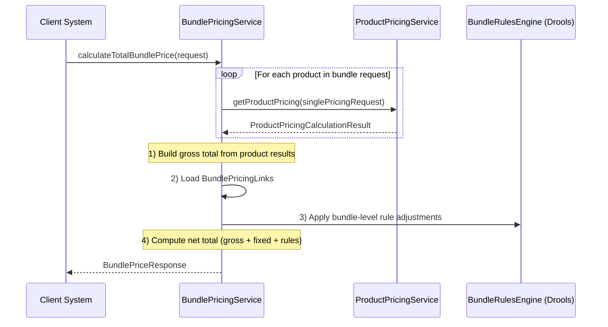
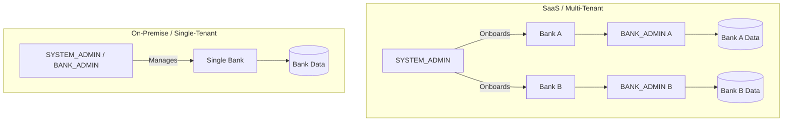

# Plexus
### Project Status
[](https://github.com/sanjusoftware/plexus/actions/workflows/ci-build.yml)
[](https://github.com/sanjusoftware/plexus/actions/workflows/cd-deploy-azure.yml)
[](https://codecov.io/gh/sanjusoftware/plexus)

Configurable Banking Product & Pricing Engine. A flexible microservice built on Spring Boot for defining, managing, and calculating complex global banking products, features, and pricing rules.

Plexus is a scalable banking platform built with Java and Spring Boot. It implements a component-based architecture to provide complete flexibility for product managers.

## Key Capabilities:
1. **Product Catalog Service (PCS):** Define any banking product using flexible, reusable feature components (e.g., tenure, collateral type, network).
2. **Pricing Engine Service (PES):** Manage tiered pricing, fees, and interest rates, accessible via a dedicated calculation endpoint.
3. **Admin Thin Client (React):** A built-in, multi-tenant administrative UI for platform owners and bank administrators.
4. **Role-Based Access Control (RBAC):** Implemented using **JWTs** and a custom **Resource Server** architecture, enabling **granular permission checks** on all API endpoints.
5. **Rule Management Service (RMS) Integration:** Supports integration with external rules engines for dynamic calculation of discounts, waivers, and eligibility.
6. **Multi-Bank Support:** Designed for global deployment.

***

# Admin Client (React UI)

Plexus includes a built-in React-based administrative thin client for managing banks, products, and pricing.

### Features
- **Multi-tenant OIDC Discovery**: Users authenticate against their specific bank's Identity Provider by entering their Bank ID. The client supports OIDC Authorization Code Flow with PKCE.
- **System Dashboard**: Global overview for platform owners to onboard and manage banks.
- **Bank Dashboard**: Role-based view for bank administrators to manage their product catalog and pricing rules.
- **Responsive Design**: Built with Tailwind CSS and Lucide icons for a modern, mobile-friendly experience.

### Accessing the UI
The UI is integrated and served directly from the Spring Boot application on port **8080**.

**When running via Docker Compose (`docker compose up`):**
- **Landing Page**: `http://localhost:8080/`
- **Login/Discovery**: `http://localhost:8080/login`
- **Dashboard**: `http://localhost:8080/dashboard`
- *Note: The UI is bundled into the Java application. There is no separate port 3000 in the Docker production build.*

### Development & Build
The React source code is located in `src/main/frontend`.

#### 1. Development Mode (Hot Reloading)
For the best development experience with hot-reloading:
1. Ensure the Spring Boot backend is running on `localhost:8080`.
2. Navigate to `src/main/frontend`.
3. Run `npm install` and then `npm start`.
4. Access the dev UI at **`http://localhost:3000`**.
   - *Note: the checked-in frontend uses relative `/api/...` paths and does not include a committed proxy configuration. For separate-port development, add a local proxy/base URL setup to point API calls at `localhost:8080`, or use the backend-served UI on port `8080`.*

#### 2. Production Build
The frontend build is fully integrated into the Gradle lifecycle:
- Running `./gradlew build` or `./gradlew bootJar` will:
  1. Execute `npm install` to fetch dependencies.
  2. Execute `npm run build` to generate optimized production assets.
  3. Copy the assets into Gradle's packaged static resources output (`build/resources/main/static`) before creating the application artifact.
- These assets are then served by Spring Boot as static resources.
- Test-only runs such as `./gradlew test --tests ...` do **not** trigger the frontend build.

***

# Application Architecture & Multi-tenancy

Plexus is designed as a multi-tenant platform, supporting both single-instance (On-prem) and multi-instance (SaaS) deployments.

## 1. Multi-tenant Isolation
Isolation is enforced at the database level using a shared-schema, row-level filtering approach:
- **Tenant Identifier**: Every tenant-aware entity inherits from `AuditableEntity` which contains a `bank_id` column.
- **Automatic Filtering**: A Hibernate filter (`bankTenantFilter`) is automatically applied to all repository calls via an Aspect (`TenantFilterAspect`), ensuring users only see data belonging to their bank.
- **Context Management**: The `TenantContextHolder` (ThreadLocal) stores the current request's `bankId`, which is extracted from the JWT by the `JwtAuthConverter`.

## 2. Core Entities for Management
- **`BankConfiguration`**: Defines the tenant itself.
  - `bankId`: Unique readable identifier (e.g., `GLOBAL-BANK-001`).
  - `issuerUrl`: The OIDC Issuer URI for this specific tenant (e.g., `https://login.microsoftonline.com/{tenantId}/v2.0`). This is used to validate incoming JWTs.
  - `allowProductInMultipleBundles`: Business rule flag.
- **`Role`**: Bank-specific roles (e.g., `BANK_ADMIN` for `BANK_A`) are stored with their mapped permissions.

## 3. BFF Authentication Architecture (Secret-less)
Plexus utilizes a **Backend-for-Frontend (BFF)** pattern for authentication, providing a secure and simplified onboarding experience for banks.

### How it Works:
1.  **Confidential Client:** The Spring Boot backend acts as the OAuth2 Confidential Client. It handles the OIDC flow entirely, ensuring that sensitive OIDC tokens (ID tokens, Access tokens) are never exposed to the browser.
2.  **Session-Based Security:** Once authentication is successful, the backend establishes a secure, HttpOnly, encrypted session with the React frontend. The frontend communicates with the API using a standard session cookie, protected by CSRF tokens.
3.  **Secret-less PKCE Flow:** By default, Plexus uses **PKCE (Proof Key for Code Exchange)** for the OIDC flow, even for the backend client.
    - **No Client Secret Required:** This allows banks to onboard without sharing a `client_secret` with the platform, significantly reducing security risks and simplifying their internal IT approval processes.
    - **Legacy Support:** While PKCE is preferred, the platform optionally supports a `client_secret` for Identity Providers that do not yet support secret-less flows for confidential clients.

### Benefits:
- **Zero-Trust Onboarding:** Banks never have to hand over their IDP secrets.
- **Enhanced Security:** OIDC tokens are kept exclusively in the backend.
- **Simplicity:** Onboarding only requires a `bankId`, `issuerUrl`, and `clientId`.

***

# Product Catalog and Pricing Model
Plexus uses a versioned aggregate model: business definitions (`FeatureComponent`, `PricingComponent`) are reusable masters, while product and bundle links carry context-specific values. This keeps pricing logic centralized and product configuration flexible.

***

## 1. Core Pattern: Versioned Masters + Contextual Links

| Domain | Reusable Master | Link Entity | What the Link Stores |
|:--|:--|:--|:--|
| Features | `FeatureComponent` | `ProductFeatureLink` | `featureValue` for that product (string value validated against component `dataType`) |
| Product Pricing | `PricingComponent` | `ProductPricingLink` | `fixedValue`/`fixedValueType`, `targetComponentCode`, `useRulesEngine`, and optional effective dates |
| Bundle Pricing | `PricingComponent` | `BundlePricingLink` | bundle-level fixed value or rules-driven adjustment |

All versionable masters (`Product`, `ProductBundle`, `FeatureComponent`, `PricingComponent`) carry lifecycle metadata from `VersionableEntity`: `version`, `status`, `activationDate`, and `expiryDate`.

***

## 2. Current Entity Model (What Actually Exists)

| Entity | Purpose | Key Fields |
|:--|:--|:--|
| `Product` | Versioned product aggregate in catalog | `code`, `name`, `category`, `productType`, `status`, `version`, `activationDate`, `expiryDate` |
| `ProductBundle` | Versioned bundle of products | `code`, `name`, `targetCustomerSegments`, `status`, `version`, linked products/pricing |
| `FeatureComponent` | Versioned reusable feature definition | `code`, `name`, `dataType`, `status`, `version` |
| `PricingComponent` | Versioned reusable pricing definition | `code`, `name`, `type`, `proRataApplicable`, `pricingTiers`, `status`, `version` |
| `PricingTier` | Rule tier inside a pricing component | `name`, `code`, `priority`, thresholds, conditions |
| `PriceValue` | Monetary/discount value used in pricing | `rawValue`, `valueType` (`FEE_ABSOLUTE`, `FEE_PERCENTAGE`, `DISCOUNT_PERCENTAGE`, `DISCOUNT_ABSOLUTE`, `FREE_COUNT`) |
| `ProductFeatureLink` | Product -> FeatureComponent join | `featureValue` |
| `ProductPricingLink` | Product -> PricingComponent join | fixed/rules flags, target component code, effective window |
| `BundleProductLink` | ProductBundle -> Product join | `mainAccount`, `mandatory` |
| `BundlePricingLink` | ProductBundle -> PricingComponent join | fixed/rules flags, effective window |

***

## 3. Lifecycle and Versioning Behavior

- Draft-first model: create entities as `DRAFT`, then activate through dedicated endpoints.
- Direct mutation is restricted to DRAFT in aggregate patch flows.
- New versions are created via `/create-new-version` endpoints for products, bundles, and pricing components.
- Deactivation/archival uses dedicated lifecycle endpoints (for example, product deactivate moves to `ARCHIVED`).
- Responses for versionable aggregates include both `version` and `status`.

***

## 4. Calculation APIs (Current)

Pricing retrieval is request-body driven (not query-string driven):

- **Product calculation:** `POST /api/v1/pricing/calculate/product`
  - Request includes `productId`, optional `enrollmentDate`, and `customAttributes`.
  - Canonical system keys in `customAttributes` are: `CUSTOMER_SEGMENT`, `TRANSACTION_AMOUNT`, `EFFECTIVE_DATE`, `PRODUCT_ID`, `BANK_ID`.
  - Legacy aliases (for example `customerSegment`, `transactionAmount`, `effectiveDate`) are rejected with validation errors.
  - Response: `ProductPricingCalculationResult` with `finalChargeablePrice` and `componentBreakdown`.

- **Bundle calculation:** `POST /api/v1/pricing/calculate/bundle`
  - Request includes `productBundleId`, line items (`productId` + `transactionAmount`), and optional `customAttributes`.
  - Canonical bundle system keys in `customAttributes` are: `PRODUCT_BUNDLE_ID`, `EFFECTIVE_DATE`, `GROSS_TOTAL_AMOUNT`, `BANK_ID`.
  - Legacy aliases are rejected with validation errors.
  - Response: `BundlePriceResponse` with gross/net totals, bundle adjustments, and per-product pricing results.

***

## 5. End-to-End Flow (Current)

1. Define reusable masters (`FeatureComponent`, `PricingComponent` + tiers/conditions/values).
2. Create product aggregate and link features/pricing using component codes.
3. Optionally create bundle aggregate linking products and bundle-level pricing.
4. Activate product/bundle versions.
5. Use pricing calculation endpoints to compute product-level and bundle-level outcomes.

### Bundle Pricing Sequence Diagram


```mermaid
sequenceDiagram
    participant Client as Client System
    participant BPS as BundlePricingService
    participant PCS as ProductPricingService
    participant RE as BundleRulesEngine (Drools)

    Client->>BPS: calculateTotalBundlePrice(request)

    loop For each product in bundle request
        BPS->>PCS: getProductPricing(singlePricingRequest)
        PCS-->>BPS: ProductPricingCalculationResult
    end

    Note over BPS: 1) Build gross total from product results
    BPS->>BPS: 2) Load BundlePricingLinks
    BPS->>RE: 3) Apply bundle-level rule adjustments
    Note over BPS: 4) Compute net total (gross + fixed + rules)

    BPS-->>Client: BundlePriceResponse
```

## 6. Why This Model Still Works Well

* **Centralized pricing logic:** Changing one pricing tier/value updates behavior everywhere that component is linked.
* **Safe evolution:** Versioning enables new configurations without breaking live contracts.
* **Tenant-safe and auditable:** All entities are tenant-scoped and carry audit metadata for governance.

***

## 7. Development & Testing
Plexus maintains high code quality with a broad suite of integration and unit tests covering multi-tenancy, RBAC, lifecycle flows, and pricing calculation logic.

### Running Tests
```bash
./gradlew test
```
The test suite utilizes a `TestTransactionHelper` to perform idempotent data seeding, ensuring unique constraints are respected across parallel test executions by using "find-or-create" logic.

***

# Identity Provider (IDP) Integration

Plexus works with any OIDC-compatible IDP (EntraID, Keycloak, Auth0, etc.). The application identifies the tenant (bank) based on the OIDC **Issuer URL** and **Client ID** registered during onboarding.

For the browser-based login flow, the application requires one custom claim in the token returned by the IDP:
1.  **`roles`**: An array of strings representing the user's roles (e.g., `["BANK_ADMIN"]`).

The backend enriches the authenticated user with `bank_id`, `bankName`, and mapped permissions after resolving the tenant from the registered bank configuration. For direct bearer-token API access, tenant resolution can come from `bank_id`, `aud`, or the issuer URL.

### 1. Microsoft EntraID (Azure AD) Setup
To add the custom `roles` claim:
1.  **App Registration**: Register Plexus in EntraID.
2.  **Enterprise Applications**: Navigate to your app > **Single sign-on** > **Attributes & Claims**.
3.  **Custom Claim**:
    - Click **Add new claim**.
    - **Name**: `roles`.
    - **Source**: Map this to the user's security groups or a directory attribute.

### 2. Keycloak Setup
1.  **Client Scopes**: Create a new Client Scope (e.g., `plexus-scope`).
2.  **Mappers**: Add a "User Client Role" or "Hardcoded Claim" mapper for the `roles` claim.
3.  **Assign**: Assign this scope to your Plexus client.

***

# Setup & Deployment

## 1. Prerequisites
- **Java 21**: The application is built using Java 21.
- **Docker & Docker Compose**: Required for running the full stack locally.
- **Gradle 8.x**: (Optional) The project includes a Gradle wrapper (`./gradlew`).

## 2. Local Development
The fastest way to get the entire stack (App, Database, Mock OAuth) running:

### A. Network Configuration (Required)
Plexus uses a consistent hostname (`identity-provider`) to ensure that OAuth2 tokens issued in the browser match the validation records in the database.

**Add the following entry to your system's hosts file:**
- **Windows:** `C:\Windows\System32\drivers\etc\hosts` (Run Notepad as Administrator)
- **Linux/Mac:** `/etc/hosts`

```text
127.0.0.1  identity-provider
```

### B. Quick Start with Docker Compose
Once your hosts file is configured, launch the entire stack:

```bash
docker compose up --build -d
```

> If your environment still uses the legacy Compose CLI, `docker-compose up --build -d` works as well.

- **App**: `http://localhost:8080`
- **PostgreSQL**: `localhost:5432` (User: `user`, Pass: `password`, DB: `bankengine`)
- **Mock OAuth Server**: `http://identity-provider:9090/default`
  - Debugger: `http://identity-provider:9090/default/debugger`
- **Redis Commander**: `http://localhost:8081`

#### Startup cleanup for rebuildable system Redis caches
Plexus clears rebuildable **system** Redis caches on startup (for example authority discovery caches such as `systemAuthorities::*`). This is separate from user sessions and tenant/business caches.

- Property: `app.redis.clear-system-caches-on-startup`
- Pattern list: `app.redis.system-cache-patterns`

**Docker / Compose example**
Add or override the app service environment with a comma-separated list:

```yaml
services:
  app:
    environment:
      - APP_REDIS_CLEAR_SYSTEM_CACHES_ON_STARTUP=true
      - APP_REDIS_SYSTEM_CACHE_PATTERNS=systemAuthorities::*,permissionsMaster::*,controllerPermissions::*
```

Keep this list limited to **rebuildable global/system caches** only.

### B.1 One-command Hybrid Dev (Docker infra + local hot reload)
If you want faster development feedback while keeping Docker convenience, use the hybrid scripts:

- Docker runs infra only (`db`, `redis`, `oauth-mock`, `redis-ui`)
- Spring Boot runs locally with `bootRun` (hot reload via IDE/DevTools)
- React runs locally with `npm start` (hot reload on `localhost:3000`)

**Quick Commands (from repository root):**

```powershell
./scripts/dev-up.ps1     # Start everything
./scripts/dev-down.ps1   # Stop everything
```

Notes:
- The frontend dev server now proxies `/api` calls to `http://localhost:8080` via `src/main/frontend/package.json`.
- `dev-up.ps1` writes local runtime PID files into `.dev-runtime/` and reuses them to avoid duplicate process launches.
- `dev-up.ps1` runs with `SPRING_PROFILES_ACTIVE=dev` but overrides datasource settings to PostgreSQL (`localhost:5432`) for Docker-backed parity.
- In hybrid mode, `dev-up.ps1` also sets `SPRING_JPA_HIBERNATE_DDL_AUTO=update` so data is not dropped on every backend restart.
- `dev-up.ps1` stops the Docker `app` service (if running) and waits for local backend health on `:8080` before starting frontend.
- By default, `dev-up.ps1` opens backend and frontend in two tabs of one Windows Terminal window (`plexus-dev`) when `wt` is available; otherwise it falls back to separate PowerShell windows.
- `dev-down.ps1` gracefully shuts down all backend Java and frontend Node processes before stopping Docker infrastructure.

### C. Running Locally (IDE/CLI)
For active development with hot-reloading (via H2 database):

1. **Set Profile**: Ensure `SPRING_PROFILES_ACTIVE=dev` is set.
2. **Run App**:
   ```bash
   ./gradlew bootRun
   ```
- **H2 Console**: `http://localhost:8080/h2-console` (JDBC URL: `jdbc:h2:mem:plexusdb`)

**Local property override example**

Use `application-local.properties`, IDE environment variables, or shell env vars to extend the startup-cleaned system cache patterns:

```properties
app.redis.clear-system-caches-on-startup=true
app.redis.system-cache-patterns=systemAuthorities::*,permissionsMaster::*,controllerPermissions::*
```

Or with environment variables:

```powershell
$env:APP_REDIS_CLEAR_SYSTEM_CACHES_ON_STARTUP="true"
$env:APP_REDIS_SYSTEM_CACHE_PATTERNS="systemAuthorities::*,permissionsMaster::*,controllerPermissions::*"
```

## 3. Deployment to Azure

The application is configured for deployment to **Azure Web App for Containers** using **GitHub Actions**.

### A. CI/CD Pipeline
The deployment flow is split across two GitHub Actions workflows:

1. **CI Build** (`.github/workflows/ci-build.yml`)
   - Runs `./gradlew build jacocoTestReport`
   - Uploads JaCoCo coverage to Codecov
   - Builds and pushes the Docker image to **Azure Container Registry (ACR)**
2. **CD - Azure Deployment** (`.github/workflows/cd-deploy-azure.yml`)
   - Triggers after a successful CI workflow run
   - Deploys the pushed image to the Azure Web App staging environment
   - Includes a placeholder production promotion step

### B. Required GitHub Secrets
To use the provided pipeline, configure these secrets in your GitHub repository:
- `ACR_LOGIN_SERVER`: Your ACR login server (e.g., `myregistry.azurecr.io`).
- `ACR_USERNAME`: ACR service principal or admin username.
- `ACR_PASSWORD`: ACR service principal or admin password.
- `AZURE_WEBAPP_PUBLISH_PROFILE`: The publish profile XML from your Azure Web App.
- `CODECOV_TOKEN`: Required if you want the CI workflow's Codecov upload step to succeed.

### C. Startup cleanup of rebuildable system Redis caches
For container and cloud deployments, Plexus can clear rebuildable **system** Redis caches on every startup. This is useful for caches derived from code scanning or global metadata, such as authority discovery.

Recommended App Settings / environment variables:

```text
APP_REDIS_CLEAR_SYSTEM_CACHES_ON_STARTUP=true
APP_REDIS_SYSTEM_CACHE_PATTERNS=systemAuthorities::*,permissionsMaster::*,controllerPermissions::*
```

Guidance:
- Use a comma-separated list in `APP_REDIS_SYSTEM_CACHE_PATTERNS`.
- Include only caches that are safe to rebuild automatically on startup.
- Do **not** put session namespaces or tenant/business data caches into this list unless you intentionally want them invalidated on every deployment.

## 4. Environment Configuration Reference
Key properties that can be overridden via environment variables:

| Property | Environment Variable | Default (Dev) |
| :--- | :--- |:---|
| `app.security.system-bank-id` | `APP_SECURITY_SYSTEM_BANK_ID` | `SYSTEM` |
| `app.security.system-issuer` | `APP_SECURITY_SYSTEM_ISSUER` | https://login.microsoftonline.com/... |
| `app.security.system-bank-name` | `APP_SECURITY_SYSTEM_BANK_NAME` | `Plexus System Bank` |
| `app.security.system-bank-admin-name` | `APP_SECURITY_SYSTEM_BANK_ADMIN_NAME` | `System Admin` |
| `app.security.system-bank-admin-email` | `APP_SECURITY_SYSTEM_BANK_ADMIN_EMAIL` | `admin@plexus.app` |
| `app.security.system-bank-admin-currency-code` | `APP_SECURITY_SYSTEM_BANK_CURRENCY_CODE` | `USD` |
| `spring.security.oauth2.resourceserver.jwt.issuer-uri` | `JWT_ISSUER_URI` | https://login.microsoftonline.com/organizations/v2.0 |
| `swagger.auth-url` | `SWAGGER_AUTH_URL` | https://login.microsoftonline.com/.../authorize |
| `swagger.token-url` | `SWAGGER_TOKEN_URL` | https://login.microsoftonline.com/.../token |
| `springdoc.swagger-ui.oauth.client-id` | `CLIENT_ID` | `bank-engine-api` |
| `spring.session.store-type` | `SPRING_SESSION_STORE_TYPE` | `none` |
| `spring.data.redis.host` | `REDIS_HOST` | `localhost` |
| `spring.data.redis.port` | `REDIS_PORT` | `6379` |
| `app.redis.clear-system-caches-on-startup` | `APP_REDIS_CLEAR_SYSTEM_CACHES_ON_STARTUP` | `true` |
| `app.redis.system-cache-patterns` | `APP_REDIS_SYSTEM_CACHE_PATTERNS` | `systemAuthorities::*` |
| `spring.datasource.url` | `SPRING_DATASOURCE_URL` | `jdbc:h2:mem:plexusdb` |
| `spring.datasource.username` | `SPRING_DATASOURCE_USERNAME` | `sa` |
| `spring.datasource.password` | `SPRING_DATASOURCE_PASSWORD` | *(empty)* |
| `spring.profiles.active` | `SPRING_PROFILES_ACTIVE` | `dev` |

Example multi-pattern value:

```text
APP_REDIS_SYSTEM_CACHE_PATTERNS=systemAuthorities::*,permissionsMaster::*,controllerPermissions::*
```

## 5. Deployment Models: SaaS vs On-Premise

Plexus runs the **same code** for both models. The difference is purely operational.


```mermaid
graph TD
    subgraph "SaaS / Multi-Tenant"
        SA[SYSTEM_ADMIN] -->|Onboards| B1[Bank A]
        SA -->|Onboards| B2[Bank B]
        B1 --> BA1[BANK_ADMIN A]
        B2 --> BA2[BANK_ADMIN B]
        BA1 --> D1[(Bank A Data)]
        BA2 --> D2[(Bank B Data)]
    end
    subgraph "On-Premise / Single-Tenant"
        SA2[SYSTEM_ADMIN / BANK_ADMIN] -->|Manages| B3[Single Bank]
        B3 --> D3[(Bank Data)]
    end
```

### SaaS Deployment
- **Platform Owner**: Acts as `SYSTEM_ADMIN`.
- **Capability**: Can onboard multiple banks (tenants).
- **Data Isolation**: The `SYSTEM_ADMIN` can **only** onboard banks and manage global roles. They **cannot** see or modify actual bank data (products, pricing) due to granular authorities and Hibernate filters.
- **Handover**: After onboarding, the `SYSTEM_ADMIN` creates the first `BANK_ADMIN` for that tenant, who then takes over.

### On-Premise / Private Cloud
- **Ownership**: The bank owns the entire instance.
- **Setup**: `SYSTEM_ADMIN` and `BANK_ADMIN` roles might be held by the same individuals.
- **Tenant**: Typically only one tenant is ever created.

***


# Bank Administration Guide

This guide walks through the end-to-end setup of a new bank and its products.

## Step 0: Initial System Onboarding (One-time)
Before any bank can be onboarded, the system itself must be initialized.
1. **IDP Setup**: Configure your Identity Provider to issue a token with:
   - `roles`: `["SYSTEM_ADMIN"]`
   - `bank_id` is **not** required for the browser login flow; Plexus resolves the tenant from the registered issuer/client configuration and enriches the authenticated user context.
   - For direct bearer-token usage, ensure the issuer (and where relevant `aud`) matches the registered system bank configuration.
2. **Startup**: When the app starts, the `SystemAdminSeeder` reads the following from environment variables (or `application.properties`) and creates/updates the root record:
   - `APP_SECURITY_SYSTEM_BANK_ID`: The unique ID for the system bank (default: `SYSTEM`).
   - `APP_SECURITY_SYSTEM_ISSUER`: The OIDC Issuer URI for the system bank.
   - `APP_SECURITY_SYSTEM_BANK_NAME`: The name of the system bank.
   - `APP_SECURITY_SYSTEM_BANK_ADMIN_NAME`: The name of the system administrator.
   - `APP_SECURITY_SYSTEM_BANK_ADMIN_EMAIL`: The email of the system administrator.
   - `APP_SECURITY_SYSTEM_BANK_CURRENCY_CODE`: The default currency code for the system bank.
3. **Authorize**: If running locally, using `docker compose up`, you can login as system admin first by using the Authorize button on SwaggerUI.
Visit http://localhost:8080/swagger-ui/index.html to open the swagger UI.
Click the Authorize button on SwaggerUI, which will redirect to the mock provider authorization flow under `http://identity-provider:9090/default/...`.

**Important:** The system identifies the bank via the Issuer URL and Client ID. Ensure the mock server is configured as the issuer for the `SYSTEM` bank.

Enter name of the user say, 'System Admin' and the roles claim:
```json
{
  "roles": ["SYSTEM_ADMIN", "BANK_ADMIN"]
}
```

## Step 1: System Admin - Onboard a New Bank
The System Admin (Platform Owner) initializes the bank. This action creates the tenant record and automatically seeds a `BANK_ADMIN` role for that bank.

**Request:** `POST /api/v1/banks`
**Authority:** `system:bank:write`
```json
{
  "bankId": "GLOBAL-BANK-001",
  "name": "Global Bank",
  "issuerUrl": "https://login.microsoftonline.com/tenant-id-123/v2.0",
  "clientId": "bank-engine-api",
  "clientSecret": "optional-secret-only-if-required-by-idp",
  "adminName": "John Doe",
  "adminEmail": "john.doe@globalbank.com",
  "allowProductInMultipleBundles": true,
  "currencyCode": "USD",
  "categoryConflictRules": [
    { "categoryA": "RETAIL", "categoryB": "WEALTH" }
  ]
}
```

**Response:** `201 Created`
```json
{
  "bankId": "GLOBAL-BANK-001",
  "name": "Global Bank",
  "issuerUrl": "https://login.microsoftonline.com/tenant-id-123/v2.0",
  "clientId": "bank-engine-api",
  "hasClientSecret": true,
  "allowProductInMultipleBundles": true,
  "currencyCode": "USD",
  "status": "DRAFT",
  "adminName": "John Doe",
  "adminEmail": "john.doe@globalbank.com",
  "categoryConflictRules": [
    { "categoryA": "RETAIL", "categoryB": "WEALTH" }
  ]
}
```

### Note on `clientId` and `clientSecret`:
- **`clientId`**: Mandatory. The Application (Client) ID registered in the tenant bank's IDP. If omitted, it defaults to the `SYSTEM` bank's ID.
- **`clientSecret`**: **Optional**. Only required if the tenant's IDP does not support PKCE for confidential clients. For security, Plexus uses PKCE by default, so most banks should leave this field empty.
- **`adminName` & `adminEmail`**: Contact details for the bank's primary administrator.
- **`currencyCode`**: The base currency for the bank's products and pricing.

### Bank Lifecycle Management
The `status` of a bank cannot be set directly during creation or update. Instead, it is managed via dedicated administrative actions:
1. **Activation**: `POST /api/v1/banks/{bankId}/activate` - Moves a bank from `DRAFT` or `INACTIVE` to `ACTIVE`. Only `ACTIVE` banks can authenticate users.
2. **Deactivation**: `POST /api/v1/banks/{bankId}/deactivate` - Moves an `ACTIVE` bank to `INACTIVE`. This prevents further logins for that tenant.

**Instructions for Tenant IDP Admins:**
1. Register a new "Single Page Application" (SPA) in your IDP (e.g., EntraID, Keycloak).
2. Configure the Redirect URI to: `http://localhost:8080/login/oauth2/code/callback` (or your production domain equivalent).
3. Enable "Authorization Code Flow with PKCE".
4. Provide the resulting **Application (Client) ID** to the Plexus System Admin for onboarding.

> **Note on Isolation**: Even though the `SYSTEM_ADMIN` creates the bank, they cannot see the bank's products or pricing data. Their authorities are restricted to `system:*` and `auth:*`.

## Step 2: Bank Admin - Handover & Configuration
Once the bank is created, the IDP admin for bank `GLOBAL-BANK-001` must configure their users to have the `roles: ["BANK_ADMIN"]` claim.
The bank admin can then login using their own IDP provider (registered as `issuerUrl` during onboarding) and update their bank's configuration.
Note that a `BANK_ADMIN` role is automatically created at the time of on-boarding with all bank-level permissions (excluding `system:*` authorities).

**Request:** `PUT /api/v1/banks`
**Authority:** `bank:config:write`
```json
{
  "bankId": "GLOBAL-BANK-001",
  "allowProductInMultipleBundles": false,
  "categoryConflictRules": [
    { "categoryA": "RETAIL", "categoryB": "INVESTMENT" }
  ]
}
```

**Response:** `200 OK`
```json
{
  "bankId": "GLOBAL-BANK-001",
  "name": "Global Bank",
  "issuerUrl": "https://login.microsoftonline.com/tenant-id-123/v2.0",
  "clientId": "bank-engine-api",
  "hasClientSecret": true,
  "allowProductInMultipleBundles": false,
  "currencyCode": "USD",
  "status": "ACTIVE",
  "adminName": "John Doe",
  "adminEmail": "john.doe@globalbank.com",
  "categoryConflictRules": [
    { "categoryA": "RETAIL", "categoryB": "INVESTMENT" }
  ]
}
```

## Step 3: Bank Admin - Configure Roles & Permissions
The Bank Admin for `GLOBAL-BANK-001` can then define other custom roles and map those roles to permissions they want to provide.

**Request:** `POST /api/v1/roles/mapping`
**Authority:** `auth:role:write`
```json
{
  "roleName": "PRODUCT_MANAGER",
  "authorities": ["catalog:product:create", "catalog:product:read", "catalog:product:update"]
}
```

**Response:** `201 Created`
```json
{
  "id": 201,
  "name": "PRODUCT_MANAGER",
  "bankId": "GLOBAL-BANK-001",
  "authorities": ["catalog:product:create", "catalog:product:read", "catalog:product:update"],
  "createdAt": "2026-03-01T10:00:00Z",
  "updatedAt": "2026-03-01T10:00:00Z"
}
```

## Step 4: Bank Admin - Setup Product Metadata
Define the foundation for products.

### 0. Register Pricing Input Metadata (Mandatory)
Before creating a **Pricing Component**, any attribute used in rules (for example `INCOME`, `LOYALTY_SCORE`) must be registered in the metadata registry. Failure to do so will result in errors like:
`"Invalid rule attribute 'income'. Not found in PricingInputMetadata registry."`

The platform also seeds protected system metadata for every tenant automatically (`CUSTOMER_SEGMENT`, `TRANSACTION_AMOUNT`, `EFFECTIVE_DATE`, `PRODUCT_ID`, `PRODUCT_BUNDLE_ID`, `GROSS_TOTAL_AMOUNT`, `BANK_ID`). These system rows are available in UI dropdowns and cannot be deleted.

To avoid hardcoded UI drift, the frontend can fetch canonical system keys from:

**Request:** `GET /api/v1/pricing-metadata/system-attributes`
**Authority:** `pricing:metadata:read`

Example response:
```json
[
  "BANK_ID",
  "CUSTOMER_SEGMENT",
  "EFFECTIVE_DATE",
  "GROSS_TOTAL_AMOUNT",
  "PRODUCT_BUNDLE_ID",
  "PRODUCT_ID",
  "TRANSACTION_AMOUNT"
]
```

**Request:** `POST /api/v1/pricing-metadata`
**Authority:** `pricing:metadata:create`
```json
{
  "attributeKey": "INCOME",
  "displayName": "Annual Income",
  "dataType": "DECIMAL"
}
```

**Response:** `201 Created`
```json
{
  "attributeKey": "INCOME",
  "displayName": "Annual Income",
  "dataType": "DECIMAL"
}
```
* **attributeKey**: The internal key used in rules (canonical format: `UPPER_SNAKE_CASE`).
* **displayName**: User-friendly label for the UI.
* **dataType**: Used for validation and rule generation. Allowed: `STRING`, `DECIMAL`, `INTEGER`, `BOOLEAN`, `DATE`.

### A. Create Product Type
**Request:** `POST /api/v1/product-types`
**Authority:** `catalog:product-type:create`
```json
{
  "name": "Current Accounts",
  "code": "CASA"
}
```

**Response:** `201 Created`
```json
{
  "id": 1,
  "name": "Current Accounts",
  "code": "CASA",
  "status": "DRAFT"
}
```
*Assuming ID returned is `1`.*

### B. Create Feature Component
**Request:** `POST /api/v1/features`
**Authority:** `catalog:feature:create`
```json
{
  "code": "LOUNGE-ACCESS",
  "name": "Free access to all premium airport lounges",
  "dataType": "STRING"
}
```

**Response:** `201 Created`
```json
{
  "id": 10,
  "code": "LOUNGE-ACCESS",
  "name": "Free access to all premium airport lounges",
  "dataType": "STRING",
  "status": "DRAFT",
  "version": 1,
  "createdAt": "2026-03-01T10:00:00Z",
  "updatedAt": "2026-03-01T10:00:00Z"
}
```
*Assuming ID returned is `10`.*

### C. Create Pricing Component
**Request:** `POST /api/v1/pricing-components`
**Authority:** `pricing:component:create`
```json
{
  "code": "MONTHLY_MAIN_FEE",
  "name": "Monthly maintenance fee",
  "type": "FEE",
  "description": "Standard monthly fee with segment-based tiers",
  "proRataApplicable": false,
  "pricingTiers": [
    {
      "name": "Premium Segment",
      "code": "PREMIUM_SEGMENT",
      "priority": 10,
      "minThreshold": 0,
      "maxThreshold": 100000,
      "applyChargeOnFullBreach": false,
      "conditions": [
        { "attributeName": "CUSTOMER_SEGMENT", "operator": "EQ", "attributeValue": "PREMIUM", "connector": "AND" }
      ],
      "priceValue": {
        "priceAmount": 5.00,
        "valueType": "FEE_ABSOLUTE"
      }
    },
    {
      "name": "Fallback Tier",
      "code": "FALLBACK_TIER",
      "conditions": [
        { "attributeName": "CUSTOMER_SEGMENT", "operator": "EQ", "attributeValue": "RETAIL" }
      ],
      "priceValue": {
        "priceAmount": 15.00,
        "valueType": "FEE_ABSOLUTE"
      }
    }
  ]
}
```

Notes:
- Before creating pricing components, register all rule attributes via `POST /api/v1/pricing-metadata` (Step 4.0). Otherwise, requests can fail with errors like `Invalid rule attribute 'income'. Not found in PricingInputMetadata registry.`
- `type` allowed values: `FEE`, `INTEREST_RATE`, `WAIVER`, `BENEFIT`, `DISCOUNT`, `PACKAGE_FEE`, `TAX`
- Higher `priority` values are evaluated first; if omitted, the tier is assigned the lowest priority.
- Tiers with the same `priority` are treated at the same evaluation level.
- `proRataApplicable` indicates whether the component may be prorated based on dates.
- `applyChargeOnFullBreach` controls whether a breached threshold applies the full charge instead of only the exceeded portion.

**Response:** `201 Created`
```json
{
  "id": 100,
  "code": "MONTHLY_MAIN_FEE",
  "name": "Monthly maintenance fee",
  "type": "FEE",
  "description": "Standard monthly fee with segment-based tiers",
  "status": "DRAFT",
  "version": 1,
  "proRataApplicable": false,
  "pricingTiers": [
    {
      "id": 1001,
      "name": "Premium Segment",
      "code": "PREMIUM_SEGMENT",
      "priority": 10,
      "minThreshold": 0,
      "maxThreshold": 100000,
      "conditions": [
        { "attributeName": "CUSTOMER_SEGMENT", "operator": "EQ", "attributeValue": "PREMIUM", "connector": "AND" }
      ],
      "priceValues": [
        {
          "componentCode": "MONTHLY_MAIN_FEE",
          "rawValue": 5.00,
          "valueType": "FEE_ABSOLUTE",
          "proRataApplicable": false,
          "applyChargeOnFullBreach": false,
          "sourceType": "CATALOG",
          "matchedTierCode": "PREMIUM_SEGMENT",
          "matchedTierId": 1001
        }
      ]
    },
    {
      "id": 1002,
      "name": "Fallback Tier",
      "code": "FALLBACK_TIER",
      "priority": -2147483648,
      "conditions": [
        { "attributeName": "CUSTOMER_SEGMENT", "operator": "EQ", "attributeValue": "RETAIL", "connector": null }
      ],
      "priceValues": [
        {
          "componentCode": "MONTHLY_MAIN_FEE",
          "rawValue": 15.00,
          "valueType": "FEE_ABSOLUTE",
          "proRataApplicable": false,
          "applyChargeOnFullBreach": false,
          "sourceType": "CATALOG",
          "matchedTierCode": "FALLBACK_TIER",
          "matchedTierId": 1002
        }
      ]
    }
  ]
}
```
*Assuming ID returned is `100`.*

### D. Retrieve Pricing Component by Code (Latest or Specific Version)
Use this endpoint when you want to resolve a pricing component by business code instead of numeric ID.

**Request:** `GET /api/v1/pricing-components/code/{code}`
**Authority:** `pricing:component:read`

Latest version (when `version` is omitted):
```http
GET /api/v1/pricing-components/code/MONTHLY_MAIN_FEE
```

Specific version:
```http
GET /api/v1/pricing-components/code/MONTHLY_MAIN_FEE?version=2
```

Behavior:
- If `version` is provided, that exact version is returned.
- If `version` is omitted, the latest available version for the code is returned.

**Response:** `200 OK`
```json
{
  "id": 100,
  "code": "MONTHLY_MAIN_FEE",
  "name": "Monthly maintenance fee",
  "type": "FEE",
  "description": "Standard monthly fee with segment-based tiers",
  "status": "ACTIVE",
  "version": 2,
  "proRataApplicable": false,
  "pricingTiers": [
    {
      "id": 1001,
      "name": "Premium Segment",
      "code": "PREMIUM_SEGMENT",
      "priority": 10,
      "priceValues": [
        {
          "componentCode": "MONTHLY_MAIN_FEE",
          "rawValue": 5.00,
          "valueType": "FEE_ABSOLUTE",
          "sourceType": "CATALOG"
        }
      ]
    }
  ]
}
```

Common errors:

**Response:** `400 Bad Request` (invalid query parameter format)
```json
{
  "timestamp": "2026-04-04T10:10:00",
  "status": 400,
  "error": "Bad Request",
  "message": "Failed to convert value of type 'java.lang.String' to required type 'java.lang.Integer'",
  "path": "/api/v1/pricing-components/code/MONTHLY_MAIN_FEE"
}
```

**Response:** `404 Not Found` (no matching code/version in current tenant)
```json
{
  "timestamp": "2026-04-04T10:11:00",
  "status": 404,
  "error": "Not Found",
  "message": "Pricing Component not found with code: MONTHLY_MAIN_FEE and version: 99",
  "path": "/api/v1/pricing-components/code/MONTHLY_MAIN_FEE"
}
```

## Step 5: Bank Admin - Create and Configure Product
Plexus uses a **FAT DTO** pattern, allowing you to create the product, its features, and its pricing links in a single atomic request.

### A. Create Product Aggregate (DRAFT)
**Request:** `POST /api/v1/products`
**Authority:** `catalog:product:create`
```json
{
  "code": "GLB-SAV-001",
  "name": "Global Savings",
  "productTypeCode": "CASA",
  "category": "RETAIL",
  "activationDate": "2026-03-01",
  "expiryDate": "2030-12-31",
  "tagline": "Grow your wealth faster",
  "fullDescription": "A high-yield savings account with no hidden fees.",
  "features": [
    {
      "featureComponentCode": "LOUNGE-ACCESS",
      "featureValue": "10"
    }
  ],
  "pricing": [
    {
      "pricingComponentCode": "MONTHLY_MAIN_FEE",
      "fixedValue": 12.00,
      "fixedValueType": "FEE_ABSOLUTE",
      "useRulesEngine": false
    }
  ],
  "iconUrl": "https://cdn.plexus.com/icons/savings.png",
  "displayOrder": 1,
  "featured": true
}
```

**Response:** `201 Created`
```json
{
  "id": 500,
  "code": "GLB-SAV-001",
  "name": "Global Savings",
  "version": 1,
  "bankId": "GLOBAL-BANK-001",
  "activationDate": "2026-03-01",
  "expiryDate": "2030-12-31",
  "status": "DRAFT",
  "category": "RETAIL",
  "productType": {
    "id": 1,
    "name": "Current Accounts",
    "code": "CASA",
    "status": "ACTIVE"
  },
  "createdAt": "2026-03-01T10:00:00Z",
  "updatedAt": "2026-03-01T10:00:00Z",
  "tagline": "Grow your wealth faster",
  "fullDescription": "A high-yield savings account with no hidden fees.",
  "iconUrl": "https://cdn.plexus.com/icons/savings.png",
  "displayOrder": 1,
  "featured": true,
  "features": [
    {
      "featureComponentCode": "LOUNGE-ACCESS",
      "featureName": "Free access to all premium airport lounges",
      "dataType": "STRING",
      "featureValue": "10"
    }
  ],
  "pricing": [
    {
      "pricingComponentCode": "MONTHLY_MAIN_FEE",
      "pricingComponentName": "Monthly maintenance fee",
      "fixedValue": 12.00,
      "fixedValueType": "FEE_ABSOLUTE",
      "useRulesEngine": false
    }
  ]
}
```
*Assuming ID returned is `500`.*

### B. Activate Product
**Request:** `POST /api/v1/products/500/activate`
**Authority:** `catalog:product:activate`

**Response:** `200 OK`
```json
{
  "id": 500,
  "code": "GLB-SAV-001",
  "name": "Global Savings",
  "version": 1,
  "bankId": "GLOBAL-BANK-001",
  "activationDate": "2026-03-01",
  "expiryDate": "2030-12-31",
  "status": "ACTIVE",
  "category": "RETAIL",
  "productType": {
    "id": 1,
    "name": "Current Accounts",
    "code": "CASA",
    "status": "ACTIVE"
  },
  "createdAt": "2026-03-01T10:00:00Z",
  "updatedAt": "2026-03-01T10:05:00Z",
  "tagline": "Grow your wealth faster",
  "fullDescription": "A high-yield savings account with no hidden fees.",
  "iconUrl": "https://cdn.plexus.com/icons/savings.png",
  "displayOrder": 1,
  "featured": true,
  "features": [
    {
      "featureComponentCode": "LOUNGE-ACCESS",
      "featureName": "Free access to all premium airport lounges",
      "dataType": "STRING",
      "featureValue": "10"
    }
  ],
  "pricing": [
    {
      "pricingComponentCode": "MONTHLY_MAIN_FEE",
      "pricingComponentName": "Monthly maintenance fee",
      "fixedValue": 12.00,
      "fixedValueType": "FEE_ABSOLUTE",
      "useRulesEngine": false
    }
  ]
}
```

### B.1 Deactivate/Archive Product (Optional)
**Request:** `POST /api/v1/products/500/deactivate`
**Authority:** `catalog:product:deactivate`

**Response:** `200 OK`
Returns the same ProductResponse with status updated to `ARCHIVED`.

### C. Create New Version (Optional)
**Request:** `POST /api/v1/products/500/create-new-version`
**Authority:** `catalog:product:create`
```json
{
  "activationDate": "2026-04-01"
}
```

**Response:** `201 Created`
Returns a new DRAFT product version with the incremented version number and the specified activation date.

## Step 6: Bank Admin - Create Product Bundle
**Request:** `POST /api/v1/bundles`
**Authority:** `catalog:bundle:create`
```json
{
  "code": "GOLD-ELITE-001",
  "name": "Gold Elite Bundle",
  "description": "Premium savings bundle",
  "targetCustomerSegments": "RETAIL",
  "activationDate": "2026-03-01",
  "expiryDate": "2030-12-31",
  "products": [
    {
      "productCode": "GLB-SAV-001",
      "mandatory": true,
      "mainAccount": true
    }
  ]
}
```

**Response:** `201 Created`
```json
{
  "id": 300,
  "code": "GOLD-ELITE-001",
  "name": "Gold Elite Bundle",
  "version": 1,
  "bankId": "GLOBAL-BANK-001",
  "description": "Premium savings bundle",
  "targetCustomerSegments": "RETAIL",
  "activationDate": "2026-03-01",
  "expiryDate": "2030-12-31",
  "status": "DRAFT",
  "createdAt": "2026-03-01T10:00:00Z",
  "updatedAt": "2026-03-01T10:00:00Z",
  "products": [
    {
      "productCode": "GLB-SAV-001",
      "productName": "Global Savings",
      "mandatory": true,
      "mainAccount": true
    }
  ]
}
```

### Bundle Activation (Optional)
**Request:** `POST /api/v1/bundles/300/activate`
**Authority:** `catalog:bundle:activate`

**Response:** `200 OK`
Returns the updated ProductBundleResponse with status set to `ACTIVE`.

### Bundle Archival (Optional)
**Request:** `DELETE /api/v1/bundles/300`
**Authority:** `catalog:bundle:delete`

**Response:** `204 No Content`
The bundle is archived and no longer available for new enrollments.

## Step 7: Bank Admin - Verify via Calculation
**Request:** `POST /api/v1/pricing/calculate/product`
**Authority:** `pricing:calculate:read`
```json
{
  "productId": 500,
  "enrollmentDate": "2026-03-01",
  "customAttributes": {
    "CUSTOMER_SEGMENT": "RETAIL",
    "TRANSACTION_AMOUNT": 5000,
    "EFFECTIVE_DATE": "2026-03-01",
    "atm_count": 3,
    "spending_total": 1500
  }
}
```

**Response:** `200 OK`
```json
{
  "finalChargeablePrice": 15.00,
  "componentBreakdown": [
    {
      "componentCode": "MONTHLY_MAIN_FEE",
      "targetComponentCode": "MONTHLY_MAIN_FEE",
      "rawValue": 15.00,
      "valueType": "FEE_ABSOLUTE",
      "proRataApplicable": false,
      "applyChargeOnFullBreach": true,
      "calculatedAmount": 15.00,
      "sourceType": "FIXED_VALUE",
      "matchedTierCode": "STANDARD_RETAIL",
      "matchedTierId": 1002
    }
  ]
}
```

***

# Future Roadmap & Admin Client Improvements
To facilitate the development of a thin client for administration, the following improvements are planned:

1.  **Metadata Discovery**: New endpoints (e.g., `/api/v1/metadata/schema/{entity}`) to provide JSON schema for dynamic form generation in the UI.
2.  **Bulk Operations**: Support for batch activation, archiving, and updates for products and bundles to improve operational efficiency.
3.  **Structured Validation Feedback**: Transitioning from generic error messages to structured, field-level business rule violation reports.
4.  **Dry-run Validation**: A `/validate` endpoint for aggregate DTOs to provide real-time UI feedback without persistence.
5.  **Audit & Impersonation**: Enhanced auditing and a controlled "impersonation mode" for System Admins to assist Bank Admins in read-only mode.
